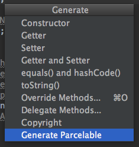

# AndroidParcelablePlugin

Intellij IDEA(Android Studio) Plugin for Android Parcelable.

## Supported types

- Types implementing `Parcelable`
- Types implementing `Serializable`
- `Parcelable` list / array
- `Serializable` list / array
- Primitive types: `int`, `float`, `double`, `long`, `boolean`, `byte`, `short`, `String` and their Wrapper type
- Arrays of Primitive types and their Wrapper types
- `IBinder`
- `SparseArray`
- `PersistableBundle`
- `Map`
- `Size`
- `SizeF`
- `CharSequence`

##Implement Parcelable interface:

```java
public class Person {
    private int id;
    private String name;
    private String address;
    private boolean deleted;
    private Float weight;
    private Double height;
    private Byte gender;
    private String[] nickNames;
    private Bundle bundle;
    private Pet pet;
    private Date date;
    private List<Phone> phones;
    private List<Pet> otherPets;
    private IBinder iBinder;
    private SparseArray sparseArray;
    private PersistableBundle persistableBundle;
    private Phone[] phoneArray;
}

class Phone {
    private String model;
    private Integer size;
}

class Pet implements Serializable {
    private String name;
}
```

== generate... ==>

```java
public class Person implements Parcelable {
    public static final Parcelable.Creator<Person> CREATOR = new Parcelable.Creator<Person>() {
        @Override
        public Person[] newArray(int size) {
            return new Person[size];
        }

        @Override
        public Person createFromParcel(Parcel in) {
            return new Person(in);
        }
    };
    private int id;
    private String name;
    private String address;
    private boolean deleted;
    private Float weight;
    private Double height;
    private Byte gender;
    private String[] nickNames;
    private Bundle bundle;
    private Pet pet;
    private Date date;
    private List<Phone> phones;
    private List<Pet> otherPets;
    private IBinder iBinder;
    private SparseArray sparseArray;
    private PersistableBundle persistableBundle;
    private Phone[] phoneArray;

    public Person(Parcel in) {
        id = in.readInt();
        name = in.readString();
        address = in.readString();
        deleted = 1 == in.readByte();
        weight = (Float) in.readValue(Float.class.getClassLoader());
        height = (Double) in.readValue(Double.class.getClassLoader());
        gender = (Byte) in.readValue(Byte.class.getClassLoader());
        nickNames = in.createStringArray();
        bundle = in.readParcelable(Bundle.class.getClassLoader());
        pet = (Pet) in.readSerializable();
        date = (Date) in.readSerializable();
        phones = in.createTypedArrayList(Phone.CREATOR);
        otherPets = (List<Pet>) in.readValue(Pet.class.getClassLoader());
        iBinder = (IBinder) in.readValue(IBinder.class.getClassLoader());
        sparseArray = (SparseArray) in.readValue(SparseArray.class.getClassLoader());
        persistableBundle = in.readParcelable(PersistableBundle.class.getClassLoader());
        phoneArray = in.createTypedArray(Phone.CREATOR);
    }

    @Override
    public void writeToParcel(Parcel out, int flags) {
        out.writeInt(id);
        out.writeString(name);
        out.writeString(address);
        out.writeByte((byte) (deleted ? 1 : 0));
        out.writeValue(weight);
        out.writeValue(height);
        out.writeValue(gender);
        out.writeStringArray(nickNames);
        out.writeParcelable(bundle, 0);
        out.writeSerializable(pet);
        out.writeSerializable(date);
        out.writeTypedList(phones);
        out.writeValue(otherPets);
        out.writeValue(iBinder);
        out.writeValue(sparseArray);
        out.writeParcelable(persistableBundle, 0);
        out.writeTypedArray(phoneArray, 0);
    }

    @Override
    public int describeContents() {
        return 0;
    }
}

class Phone implements Parcelable {
    public static final Parcelable.Creator<Phone> CREATOR = new Parcelable.Creator<Phone>() {
        @Override
        public Phone[] newArray(int size) {
            return new Phone[size];
        }

        @Override
        public Phone createFromParcel(Parcel in) {
            return new Phone(in);
        }
    };
    private String model;
    private Integer size;

    public Phone(Parcel in) {
        model = in.readString();
        size = (Integer) in.readValue(Integer.class.getClassLoader());
    }

    @Override
    public void writeToParcel(Parcel out, int flags) {
        out.writeString(model);
        out.writeValue(size);
    }

    @Override
    public int describeContents() {
        return 0;
    }
}

class Pet implements Serializable {
    private String name;
}
```

## How to use

### 1. Install the "Parcelable Generator For Android" plugin.

`Preferences` --> `Plugins` --> `Install Plugin from disk` --> Restart IDEA


###2. Open "Generate Parcelable"  item menu.

- Right click -> `generate...` -> `Generate Parcelable`

OR

- `Control` + `Enter` -> `Generate Parcelable`



License
=======

    Copyright 2015 Wang Jie

    Licensed under the Apache License, Version 2.0 (the "License");
    you may not use this file except in compliance with the License.
    You may obtain a copy of the License at

       http://www.apache.org/licenses/LICENSE-2.0

    Unless required by applicable law or agreed to in writing, software
    distributed under the License is distributed on an "AS IS" BASIS,
    WITHOUT WARRANTIES OR CONDITIONS OF ANY KIND, either express or implied.
    See the License for the specific language governing blacklist and
    limitations under the License.
